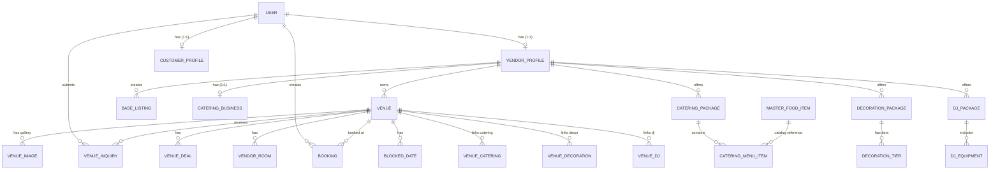

# PlanMyVivah Complete Project Audit

> **Single Source of Truth Document**  
> **Project:** PlanMyVivah (Wedding & Event Planning Marketplace)  
> **Audit Date:** August 10, 2026  
> **Auditor Role:** Principal Full-Stack Architect, Django/Python Backend Engineer, Frontend Engineer, PostgreSQL Database Architect, API Integration Auditor, DevOps Engineer, Security Reviewer, QA Engineer, Technical Documentation Specialist.

---

## 1. Executive Summary

This master audit document provides an exhaustive, evidence-based assessment of the **PlanMyVivah** codebase. PlanMyVivah is a full-stack B2B2C wedding and event planning platform designed for the Indian marketplace (focused primarily on Madhya Pradesh, e.g., Bhopal, Indore). It connects end customers (couples/families), service vendors (venue owners, caterers, decorators, DJs, photographers, planners), and platform administrators.

Every feature, model, endpoint, component, and user flow documented herein has been directly inspected from the source code across both the Django backend repository (`celebrationplatform/`) and the Next.js frontend repository (`frontend/`). Nothing has been assumed to exist based solely on UI presence or database stubs.

---

## 2. Project Overview

### Project Name
**PlanMyVivah** (Backend repository: `celebrationplatform`, Frontend repository: `frontend`)

### Project Type
Multi-Role Event Planning Marketplace & Digital Venue Booking Platform (B2B2C)

### Main Objective
To digitize and streamline the wedding planning experience in India by offering:
1. **Customers:** A unified catalog of verified venues and services with transparent starting prices, dynamic quote calculation, gated pricing unlock via OTP, and lead inquiry submission.
2. **Vendors:** A digital storefront to list venues, catering packages, decoration tiers, DJ equipment, manage availability/blocked dates, and view lead inquiries.
3. **Platform (PlanMyVivah):** Direct monetization via platform commission/royalty (5% default) plus GST (18%), lead distribution, and central venue verification.

---

## 3. Technology Stack

### Frontend Repository (`frontend/`)
* **Framework:** Next.js 15.1.0 (App Router, Server Components & Client Components)
* **Language:** TypeScript 5.x
* **UI Library:** Tailwind CSS 3.4.1, Lucide React 0.474.0, Framer Motion 12.4.7
* **State Management:** Zustand 5.0.3 (`useStore`), React Query (`@tanstack/react-query` 5.66.0)
* **API Client:** Axios 1.7.9 (`api.ts` with JWT bearer interceptor & auto-refresh flow)
* **Routing:** Next.js App Router with route groups `(admin)`, `(customer)`, `(vendor)`, `(onboarding)`
* **Build System & Package Manager:** Node.js, `npm`

### Backend Repository (`celebrationplatform/`)
* **Language & Runtime:** Python 3.x
* **Framework:** Django 4.2.13
* **API Layer:** Django REST Framework 3.15.1
* **Authentication:** SimpleJWT 5.3.1 (Custom 6-digit phone OTP authentication & 4-digit gated pricing OTP)
* **API Documentation:** `drf-spectacular` 0.27.2 (OpenAPI 3.0 / Swagger UI at `/api/docs/`)
* **Database & ORM:** PostgreSQL (via `psycopg2-binary` 2.9.9), Django ORM
* **Task Queue & Caching:** Celery 5.3.6 (configured), Redis / `django-redis` 5.0.4 (configured)
* **Payment Integration:** Razorpay 1.4.1 (installed in `requirements.txt`, not wired to flows)
* **Media & Storage:** Pillow 10.3.0, `django-storages` (Local media storage / AWS S3 conditional)

### Infrastructure & DevOps Found in Codebase
* **Local Development Environment:** `manage.py`, `Makefile`, `run.bat`, `sync.bat`
* **Static / Media Serving:** Django local media handler (`/media/`), CORS headers (`django-cors-headers` 4.3.1)
* **Docker / Cloud Infrastructure:** Dockerfile, docker-compose, CI/CD scripts are **NOT FOUND** in repository.

---

## 4. REPOSITORY STRUCTURE

### Backend Repository (`celebrationplatform/`)
```text
celebrationplatform/
├── config/
│   ├── settings/
│   │   ├── base.py              # Shared REST, JWT, CORS, installed apps settings
│   │   ├── development.py       # Local DB (PostgreSQL localhost:5434), console email
│   │   └── production.py        # Production S3, security settings
│   ├── urls.py                  # Main router (/api/v1/, /admin/, /api/docs/)
│   └── wsgi.py
├── apps/
│   ├── accounts/                # User, VendorProfile, CustomerProfile, OTPVerification
│   ├── venues/                  # Venue, VenueImage, VenueInquiry, VenueDeal, VendorRoom
│   ├── bookings/                # Booking, BlockedDate, VenueAvailability
│   ├── catering/                # CateringBusiness, CateringPackage, CateringMenuItem, MasterFoodItem, VenueCatering
│   ├── decorations/             # DecorationPackage, DecorationTier, VenueDecoration
│   ├── dj/                      # DJPackage, DJEquipment, DJBookingEquipment, VenueDJ
│   ├── listings/                # BaseListing, PhotographerDetail, MakeupDetail, PlannerDetail
│   ├── common/                  # Roles, Messages, Response Envelope, Exception handlers, Seed command
│   ├── ai_services/             # LLM, Embedding, Prompt builder stubs
│   ├── ai_agents/               # VenueAgent, BudgetAgent, DecorAgent stubs
│   └── analytics/               # Analytics service/repository stubs
├── manage.py
├── requirements.txt
└── tests/                       # Unit tests for accounts, venues, dj
```

#### Detailed Django App Summary:
1. **`accounts`**: Custom phone-based User model, OTP generation/verification, Vendor onboarding, Customer profile, Admin login controller, Role permissions (`IsVendor`, `IsCustomer`, `IsAdmin`, `IsApprovedVendor`).
2. **`venues`**: Core venue catalog, 40+ fields per venue, multi-parameter search/filtering repository, gallery images, promotional deals, vendor rooms, gated pricing breakdown, inquiry post-save signals.
3. **`bookings`**: Booking entity, blocked date calendar management, date availability tracker, admin booking view.
4. **`catering`**: Catering business profiles, branches, plate pricing tiers, custom menu items linked to master food item catalog (140+ items).
5. **`decorations`**: Decoration package catalog, tier pricing (low/medium/average/high), venue-decoration policy linking.
6. **`dj`**: DJ packages, equipment inventory management (included vs. add-on), live equipment quote calculation.
7. **`listings`**: Generic multi-category base listing system with status state machine (draft/pending_approval/active/suspended) and specific details for photographers, makeup artists, planners.
8. **`common`**: Standardized response helpers (`Response.success`), pagination (12 items/page), `seed_all` management command.

---

### Frontend Repository (`frontend/`)
```text
frontend/
├── src/
│   ├── app/
│   │   ├── (admin)/admin/
│   │   │   └── dashboard/      # Admin console (Approvals, Listings, Queries, Analytics, Bookings)
│   │   ├── (vendor)/vendor/
│   │   │   ├── dashboard/      # Vendor partner console & incoming leads list
│   │   │   ├── listings/       # Vendor service & venue listings catalog
│   │   │   ├── onboarding/     # Multi-step vendor registration onboarding
│   │   │   └── profile/        # Vendor business profile editor
│   │   ├── (customer)/customer/ # Customer profile & inquiry tracking
│   │   ├── (onboarding)/        # Customer onboarding wizard
│   │   ├── ai-planner/          # Interactive AI wedding concierge demo page
│   │   ├── services/            # Services catalog browsing page
│   │   ├── venues/
│   │   │   ├── page.tsx         # Venue search, filter, marquee & listing grid page
│   │   │   └── [id]/page.tsx    # Venue detail, pricing breakdown calculator & inquiry modal
│   │   ├── page.tsx             # Homepage (Hero, Marquee, Features, Featured Venues, AI Concierge)
│   │   ├── layout.tsx
│   │   └── providers.tsx        # React Query Client provider
│   ├── components/              # Navbar, Footer, HeroSection, FeaturedVenues, GatedBookingModal, AIConcierge, etc.
│   ├── lib/
│   │   ├── api.ts               # Axios instance, request interceptor (Bearer token), response 401 refresh
│   │   ├── authApi.ts           # Typed API wrappers for auth, vendor, status
│   │   └── proxy.ts
│   └── store/
│       └── store.ts             # Zustand store (token, userRole, user, vendorProfile, onboarding state)
├── docs/                        # Backend architecture docs & implementation status
├── next.config.ts
├── package.json
└── playwright.config.ts
```

---

## 5. COMPLETE MODULE INVENTORY

| Module | Backend App | Frontend Routes / Components | Database Models | API Endpoints | Status |
| :--- | :--- | :--- | :--- | :--- | :--- |
| **Auth & OTP** | `apps/accounts` | `Navbar.tsx`, `GatedBookingModal.tsx`, `store.ts` | `User`, `OTPVerification` | `/auth/send-otp/`, `/auth/verify-otp/`, `/auth/refresh/` | **FULLY WORKING** |
| **Vendor Onboarding** | `apps/accounts` | `/vendor/onboarding`, `authApi.ts` | `VendorProfile` | `/auth/vendor/onboard/`, `/auth/vendor/profile/`, `/auth/vendor/logo/` | **FULLY WORKING** |
| **Customer Profile** | `apps/accounts` | `/customer/profile` | `CustomerProfile` | `/auth/customer/profile/` | **FULLY WORKING** |
| **Venue Catalog** | `apps/venues` | `/venues`, `/venues/[id]`, `FeaturedVenues.tsx` | `Venue`, `VenueImage`, `VenueDeal`, `VendorRoom` | `/venues/venues/`, `/venues/venue-images/`, `/venues/venue-deals/` | **FULLY WORKING** |
| **Gated Pricing** | `apps/venues` | `/venues/[id]`, `GatedBookingModal.tsx` | `Venue`, `OTPVerification` | `/venues/venues/{id}/pricing-breakdown/`, `/auth/otp/send/`, `/auth/otp/verify/` | **FULLY WORKING** |
| **Customer Enquiry** | `apps/venues` | `/venues/[id]` (Inquiry Modal), `/vendor/dashboard` | `VenueInquiry` | `/venues/venue-inquiries/`, `/venues/admin/inquiries/` | **FULLY WORKING** (Lead submit & display works; vendor API status update missing) |
| **Catering** | `apps/catering` | `/venues/[id]` (Pricing calculator tab) | `CateringBusiness`, `CateringPackage`, `CateringMenuItem`, `MasterFoodItem`, `VenueCatering`, `CateringBooking` | `/catering/catering-packages/`, `/catering/catering-menu-items/`, `/catering/quote/` | **FULLY WORKING** |
| **Decorations** | `apps/decorations` | `/venues/[id]` (Pricing calculator tab) | `DecorationPackage`, `DecorationTier`, `VenueDecoration` | `/decorations/decoration-packages/`, `/decorations/decoration-tiers/` | **FULLY WORKING** |
| **DJ & Entertainment** | `apps/dj` | Services page | `DJPackage`, `DJEquipment`, `DJBookingEquipment`, `VenueDJ` | `/dj/packages/`, `/dj/vendor/equipment/`, `/dj/equipment/quote/` | **FULLY WORKING** |
| **Multi-Listings** | `apps/listings` | `/vendor/listings`, `/admin/dashboard` | `BaseListing`, `PhotographerDetail`, `MakeupDetail`, `PlannerDetail` | `/listings/`, `/listings/types/`, `/listings/admin/` | **FULLY WORKING** |
| **Bookings & Slots** | `apps/bookings` | Admin Dashboard | `Booking`, `BlockedDate`, `VenueAvailability` | `/bookings/blocked-dates/`, `/bookings/venue-availabilitys/`, `/bookings/admin/bookings/` | **PARTIALLY WORKING** (Backend API & models exist; Customer booking/checkout UI missing) |
| **Admin Console** | `apps/accounts`, `apps/venues` | `/admin/dashboard` | All Models | `/auth/admin/approvals/`, `/venues/admin/inquiries/analytics/`, `/listings/admin/` | **FULLY WORKING** |
| **AI Planner** | `apps/ai_services`, `apps/ai_agents` | `/ai-planner`, `AIConcierge.tsx` | None | None | **MOCK DATA / STUB** |
| **Payments** | None | None | None | None | **NOT IMPLEMENTED** |
| **Notifications** | Signal alerts | Console logger | None | None | **PARTIALLY WORKING** (Console logger in dev; SMS Gateway un-configured) |

---

## 6. USER ROLES

1. **Customer:**
   * **Registration/Login:** Phone OTP (6-digit).
   * **Permissions:** Browse public venues, view starting prices, request 4-digit OTP to unlock full pricing breakdown, submit inquiries, manage own profile.
   * **Dashboard/Routes:** `/customer/profile`, `/customer/bookings`, `/venues`.

2. **Vendor (Venue Owner, Decorator, Caterer, DJ, Planner, Photographer, Outfit, Makeup, Other):**
   * **Registration/Login:** Phone OTP (6-digit) + Onboarding form (`business_name`, `vendor_type`, `city`, `gstin`).
   * **Permissions:** Must be approved by Admin (`is_approved=true`). Once approved, can manage listings, venues, packages, and view incoming customer inquiries.
   * **Dashboard/Routes:** `/vendor/dashboard`, `/vendor/listings`, `/vendor/profile`, `/vendor/onboarding`.

3. **Admin / Super Admin / Staff:**
   * **Registration/Login:** Email/phone + Password (`/api/v1/auth/admin/login/`) or standard Django Admin (`/admin/`).
   * **Permissions:** Approve/Reject vendors, verify venues (`is_verified=true`), view all listings, monitor lead inquiries, access day-wise analytics, and review system bookings.
   * **Dashboard/Routes:** `/admin/dashboard`, `/admin/login`, `/admin/`.

---

## 7. AUTHENTICATION & AUTHORIZATION AUDIT

* **OTP Generation:** 6-digit cryptographic numeric OTP hashed into `otp_verifications` table.
* **OTP Delivery:** In local development, `dev_otp` is printed in API responses and backend logs. Real SMS gateway (e.g. Twilio/Msg91) is not wired up yet.
* **Tokens:** JWT Access Token (24 hours validity) + Refresh Token (30 days validity) issued via `SimpleJWT`.
* **Refresh Mechanism:** Handled automatically in frontend via Axios response interceptors (`/api/v1/auth/token/refresh/`).
* **Role Guards:** Backend DRF Permission Classes: `IsVendor`, `IsCustomer`, `IsAdmin`, `IsApprovedVendor`, `IsOwnerVendor`.
* **Gated Pricing OTP:** Unauthenticated users viewing venue details see starting prices only. Entering phone number triggers a 4-digit OTP flow (`/auth/otp/send/` and `/auth/otp/verify/`), issuing access tokens and unlocking the complete dynamic price breakdown (venue rent + catering + decor + 5% royalty + 18% GST).

---

## 8. CUSTOMER MODULE

### Customer Account
* **Profile Model:** `CustomerProfile` (linked 1:1 with `User`).
* **Tracked Preferences:** `wedding_date`, `partner_name`, `city`, `guest_count`, `budget_min`, `budget_max`, `planning_status`, `needs_catering`, `needs_decoration`, `needs_dj`, `needs_planner`.
* **Profile Sync:** Automatically updates customer preferences whenever an inquiry is submitted via `CustomerService.sync_profile_from_inquiry()`.

### Customer Discovery & Venue Detail Page
* **Venue Discovery (`/venues`):** Filter by City (Bhopal, Indore, etc.), Guest Capacity, Price Range, Event Date, Keyword Search, sorting by price/rating/bookings.
* **Venue Detail (`/venues/[id]`):** Shows venue info, primary image gallery, amenities, capacity, venue policies (catering/decoration/DJ), interactive dynamic price breakdown calculator, and lead inquiry form.

---

## 9. VENDOR MODULE & VENDOR TYPES

### Vendor Registration & Onboarding
* **Fields:** `full_name`, `email`, `vendor_type`, `business_name`, `description`, `city`, `state`, `address`, `gstin`.
* **GSTIN Validation:** Checked via regex (15 uppercase alphanumeric characters).
* **Logo Upload:** `POST /api/v1/auth/vendor/logo/` (max 2MB, JPEG/PNG/WebP).
* **Approval State:** Default `is_approved = false`. Admin approves via `/api/v1/auth/admin/approvals/{id}/` or Django Admin action.

### Identified Vendor Types
1. `venue` (Venue Owner)
2. `caterer` (Catering Service)
3. `decorator` (Decoration Service)
4. `dj` (DJ & Entertainment)
5. `planner` (Wedding/Event Planner)
6. `photographer` (Photography & Videography)
7. `outfit` (Outfit Rental/Design)
8. `makeup` (Bridal & Party Makeup)
9. `other` (General Event Services)

---

## 10. VENUE MODULE & LIFECYCLE

```text
Vendor Onboarding -> Admin Approval -> Create Venue (is_active=true, is_verified=false) 
  -> Upload Gallery Images -> Add Packages / Rooms 
  -> Admin Verification (is_verified=true) -> Public Catalog Listing -> Customer Inquiry
```

### Complete Venue Field Verification Matrix

| Field | Backend Model (`Venue`) | Frontend Usage | Required | Status |
| :--- | :--- | :--- | :--- | :--- |
| `name` | `CharField(255)` | Hero title & card title | Yes | **FULLY IMPLEMENTED** |
| `venue_type` | `CharField(50)` | Type badge | Yes | **FULLY IMPLEMENTED** |
| `city` | `CharField(100)` | Search filter & location badge | Yes | **FULLY IMPLEMENTED** |
| `state` | `CharField(100)` | Address display | Yes | **FULLY IMPLEMENTED** |
| `address` | `TextField` | Address display | Yes | **FULLY IMPLEMENTED** |
| `min_capacity` / `max_capacity` | `PositiveInteger` | Guest size badge & slider | Yes | **FULLY IMPLEMENTED** |
| `price_per_day` | `Decimal(10,2)` | Starting price & calculation | Yes | **FULLY IMPLEMENTED** |
| `num_ac_rooms` / `num_halls` | `PositiveInteger` | Specs list | Yes | **FULLY IMPLEMENTED** |
| `catering_policy` | `CharField(10)` | Policy tag & calculator logic | Yes | **FULLY IMPLEMENTED** |
| `decoration_policy` | `CharField(10)` | Policy tag & calculator logic | Yes | **FULLY IMPLEMENTED** |
| `dj_policy` | `CharField(10)` | Policy tag | Yes | **FULLY IMPLEMENTED** |
| `has_parking` / `is_ac` / `is_outdoor` | `BooleanField` | Amenity icons | Yes | **FULLY IMPLEMENTED** |
| `latitude` / `longitude` | `Decimal(9,6)` | Database model field | No | **BACKEND ONLY** (Map UI missing) |
| `is_verified` | `BooleanField` | Trust badge | Auto | **FULLY IMPLEMENTED** |

---

## 11. SERVICES & PACKAGE MODULES

### Catering Module
* **Models:** `CateringBusiness`, `CateringPackage`, `CateringMenuItem`, `MasterFoodItem`, `VenueCatering`, `CateringBooking`.
* **Capabilities:** Multi-tier plate pricing, veg/jain/spicy tags, weekend/festival surcharge percentages, price per plate without material options. Master food catalog contains 140+ pre-seeded items (`seed_all.py`).

### Decoration Module
* **Models:** `DecorationPackage`, `DecorationTier`, `VenueDecoration`.
* **Capabilities:** Tiered pricing (Low, Medium, Average, High), maximum area coverage (sqft), custom theme inclusions (JSON).

### DJ Module
* **Models:** `DJPackage`, `DJEquipment`, `DJBookingEquipment`, `VenueDJ`.
* **Capabilities:** Package browsing, included equipment vs. extra add-on equipment, quantity availability tracking, live equipment quote API (`POST /api/v1/dj/equipment/quote/`).

---

## 12. CUSTOMER ENQUIRY MODULE

### Complete Inquiry Lifecycle

```text
Customer fills Inquiry Form (Name, Phone, Date, Guests, Budget, Message)
   ↓
API Request: POST /api/v1/venues/venue-inquiries/
   ↓
DB Insert (VenueInquiry record created, default status = 'pending')
   ↓
Signal Triggers (post_save):
   ├── SMSWhatsAppService: Logged/Sent to Venue Owner
   ├── Email Backend: Coordinator email sent
   └── Customer Profile: Preferences automatically synced
   ↓
Vendor Dashboard (`/vendor/dashboard`): Leads visible
Admin Console (`/admin/dashboard`): Lead Analytics & Monitoring updated
```

### Enquiry Field Audit Matrix

| Field | Frontend Form | API Payload | Backend Model | Database | Status |
| :--- | :--- | :--- | :--- | :--- | :--- |
| `name` | Yes | `name` | `VenueInquiry.name` | `varchar(150)` | **FULLY IMPLEMENTED** |
| `phone` | Yes | `phone` | `VenueInquiry.phone` | `varchar(15)` | **FULLY IMPLEMENTED** |
| `email` | Optional | `email` | `VenueInquiry.email` | `varchar(254)` | **FULLY IMPLEMENTED** |
| `event_date` | Yes | `event_date` | `VenueInquiry.event_date` | `date` | **FULLY IMPLEMENTED** |
| `guest_count` | Yes | `guest_count` | `VenueInquiry.guest_count` | `integer` | **FULLY IMPLEMENTED** |
| `venue` | Selected Venue ID | `venue` | `VenueInquiry.venue_id` | `fk` | **FULLY IMPLEMENTED** |
| `message` | Textarea | `message` | `VenueInquiry.message` | `text` | **FULLY IMPLEMENTED** |
| `status` | Display badge | Read-only | `VenueInquiry.status` | `varchar(20)` | **PARTIALLY IMPLEMENTED** (Vendor API update missing; status change only via Django admin) |

---

## 13. BOOKING, PAYMENT & NOTIFICATIONS

### Booking System Status
* **Backend:** `Booking` model exists with fields `venue_amount`, `catering_amount`, `decoration_amount`, `dj_amount`, `total_amount`, `advance_paid`, `balance_due`, `payment_order_id`, `payment_payment_id`. Blocked dates management (`BlockedDateViewSet`) and availability checking endpoints (`VenueAvailabilityViewSet`) are functional.
* **Frontend:** Vendor/Customer direct online checkout UI is **NOT IMPLEMENTED**. Bookings currently function via Lead Inquiry submission.

### Payment System Status
* **Status:** **NOT IMPLEMENTED**. Razorpay package is listed in backend dependencies, but no checkout endpoints, webhooks, order creation logic, or frontend payment buttons exist.

### Notification System Status
* **Status:** **PARTIALLY IMPLEMENTED**. Django `post_save` signals fire email alerts (console backend in development environment) and trigger WhatsApp alert stubs upon lead inquiry creation. Push notifications and SMS gateway integrations are missing.

---

## 14. ADMIN MODULE

### Custom Admin Dashboard (`/admin/dashboard`)
* **Approvals Tab:** List, search, filter unapproved vendors, approve vendors, or reject with a specified reason.
* **Listings Tab:** Audit all platform multi-category listings, filter by status and category.
* **Queries & Leads Tab:** View all platform inquiries, filter by venue.
* **Analytics Bar:** Displays daily inquiry volume trends using DRF aggregation (`TruncDate` + `Count`).
* **Bookings Tab:** Monitor system bookings and blocked dates.

### Django Native Admin (`/admin/`)
* Registered models: `User`, `OTPVerification`, `VendorProfile`, `CateringBusiness`, `Branch`, `MasterFoodItem`, `CateringMenuItem`, `CateringPackage`, `VenueCatering`.

---

## 15. DATABASE & ER DIAGRAM

### Complete Django Model Inventory

| App | Model | Purpose | Key Relationships | Status |
| :--- | :--- | :--- | :--- | :--- |
| `accounts` | `User` | Custom User (Phone-based) | PK for authentication | **ACTIVE** |
| `accounts` | `OTPVerification` | Crypto OTP tokens | Linked via phone number | **ACTIVE** |
| `accounts` | `VendorProfile` | Vendor business details | `1:1` to User | **ACTIVE** |
| `accounts` | `CustomerProfile` | Customer event details | `1:1` to User | **ACTIVE** |
| `venues` | `Venue` | Main venue entity (40+ fields) | `FK` to VendorProfile, `1:1` to BaseListing | **ACTIVE** |
| `venues` | `VenueImage` | Gallery images | `FK` to Venue | **ACTIVE** |
| `venues` | `VenueInquiry` | Customer lead inquiry | `FK` to Venue, User, CateringPackage, DecorPackage | **ACTIVE** |
| `venues` | `VenueDeal` | Promotional discounts | `FK` to Venue | **ACTIVE** |
| `venues` | `VendorRoom` | Room inventory | `FK` to Venue | **ACTIVE** |
| `bookings` | `Booking` | Booking record | `FK` to Venue, User, Catering, Decor, DJ | **ACTIVE** |
| `bookings` | `BlockedDate` | Vendor blocked dates | `FK` to Venue | **ACTIVE** |
| `bookings` | `VenueAvailability` | Date availability log | `FK` to Venue | **ACTIVE** |
| `catering` | `CateringBusiness` | Catering company profile | `1:1` to VendorProfile | **ACTIVE** |
| `catering` | `CateringPackage` | Food package tier | `FK` to VendorProfile, BaseListing | **ACTIVE** |
| `catering` | `MasterFoodItem` | Global food catalog | Standalone master catalog | **ACTIVE** |
| `catering` | `CateringMenuItem` | Package food items | `FK` to CateringPackage, MasterFoodItem | **ACTIVE** |
| `catering` | `VenueCatering` | Venue catering link | `FK` to Venue, CateringPackage | **ACTIVE** |
| `decorations` | `DecorationPackage` | Decor package | `FK` to VendorProfile, BaseListing | **ACTIVE** |
| `decorations` | `DecorationTier` | Decor price tier | `FK` to DecorationPackage | **ACTIVE** |
| `dj` | `DJPackage` | DJ package | `FK` to VendorProfile, BaseListing | **ACTIVE** |
| `dj` | `DJEquipment` | Equipment inventory | `FK` to DJPackage | **ACTIVE** |
| `listings` | `BaseListing` | Unified multi-category listing | `FK` to VendorProfile | **ACTIVE** |

---

### ER Diagram



---

## 16. API INVENTORY

| Method | Endpoint | Permission | Controller / View | Frontend Usage | Status |
| :--- | :--- | :--- | :--- | :--- | :--- |
| `POST` | `/api/v1/auth/send-otp/` | AllowAny | `SendOTPController` | `authApi.sendOtp()` | **WORKING** |
| `POST` | `/api/v1/auth/verify-otp/` | AllowAny | `VerifyOTPController` | `authApi.verifyOtp()` | **WORKING** |
| `POST` | `/api/v1/auth/token/refresh/` | AllowAny | `RefreshTokenController` | `api.ts` interceptor | **WORKING** |
| `POST` | `/api/v1/auth/admin/login/` | AllowAny | `AdminLoginController` | `/admin/login` | **WORKING** |
| `POST` | `/api/v1/auth/vendor/onboard/` | IsAuthenticated | `VendorOnboardController` | `vendorApi.onboard()` | **WORKING** |
| `GET` | `/api/v1/auth/vendor/profile/` | IsVendor | `VendorProfileController` | `vendorApi.getProfile()` | **WORKING** |
| `GET` | `/api/v1/auth/vendor/status/` | IsVendor | `VendorStatusController` | `vendorApi.getStatus()` | **WORKING** |
| `GET` | `/api/v1/auth/admin/approvals/` | IsAdmin | `AdminVendorApprovalController` | Admin Dashboard | **WORKING** |
| `POST` | `/api/v1/auth/admin/approvals/{id}/` | IsAdmin | `AdminVendorApprovalController` | Admin Dashboard | **WORKING** |
| `GET` | `/api/v1/venues/venues/` | AllowAny | `VenueViewSet.list` | `/venues` page | **WORKING** |
| `GET` | `/api/v1/venues/venues/{id}/` | AllowAny | `VenueViewSet.retrieve` | `/venues/[id]` page | **WORKING** |
| `GET` | `/api/v1/venues/venues/{id}/pricing-breakdown/` | AllowAny | `VenuePricingBreakdownController` | Dynamic Calculator | **WORKING** |
| `POST` | `/api/v1/venues/venue-inquiries/` | AllowAny | `VenueInquiryViewSet.create` | Inquiry Modal | **WORKING** |
| `GET` | `/api/v1/venues/venue-inquiries/` | IsAuthenticated | `VenueInquiryViewSet.list` | Vendor Dashboard | **WORKING** |
| `GET` | `/api/v1/venues/admin/inquiries/analytics/` | IsAdmin | `AdminInquiryAnalyticsController` | Admin Dashboard | **WORKING** |
| `GET` | `/api/v1/listings/` | AllowAny | `ListingListCreateController` | Vendor Listings | **WORKING** |
| `GET` | `/api/v1/listings/admin/` | IsAdmin | `AdminListingListController` | Admin Dashboard | **WORKING** |
| `POST` | `/api/v1/dj/equipment/quote/` | AllowAny | `DJEquipmentQuoteController` | Services Quote | **WORKING** |

---

## 17. FRONTEND ↔ BACKEND CONTRACT AUDIT

### Identified Integration Field Mismatches & Solutions
1. **Venue Inquiries List Envelope:**
   * Backend returns paginated standard DRF structure `{ success: true, data: { results: [...] } }`.
   * Frontend `VendorDashboard` (`/vendor/dashboard/page.tsx`) correctly unpacks `res.data.results || res.data.data?.results || res.data.data`.
2. **Venue Detail Primary Image Fallback:**
   * Backend returns image objects in `images` array with relative path `/media/venues/images/...`.
   * Frontend helper `getImageUrl()` (`api.ts`) prepends `http://localhost:8000` for relative image paths.
3. **Inquiry Status Update Endpoint:**
   * Vendor attempts to view inquiry status on dashboard. Backend serializer marks `status` as `read_only_fields = ['id', 'user', 'status', 'created_at']`.
   * **Fix Required:** Add explicit `PATCH /api/v1/venues/venue-inquiries/{id}/status/` endpoint allowing vendors to transition status from `pending` -> `responded` -> `closed`.

---

## 18. FRONTEND ROUTE & UI AUDIT

| Route | Role Guard | API Connected | Component State | Status |
| :--- | :--- | :--- | :--- | :--- |
| `/` | Public | Yes (`/venues/venues/`) | Fully Rendered | **WORKING** |
| `/venues` | Public | Yes (`/venues/venues/`) | Listing, Search, Filters | **WORKING** |
| `/venues/[id]` | Public / Gated | Yes (`/venues/{id}/`, `/pricing-breakdown/`) | Calculator & Inquiry Modal | **WORKING** |
| `/services` | Public | Yes (`/dj/packages/`, `/catering/catering-packages/`) | Services Showcase | **WORKING** |
| `/ai-planner` | Public | No | Static Mock UI | **MOCK UI** |
| `/vendor/dashboard` | Vendor | Yes (`/venues/venue-inquiries/`) | Partner Console | **WORKING** |
| `/vendor/listings` | Vendor | Yes (`/listings/`) | Listings Catalog | **WORKING** |
| `/vendor/onboarding` | Authenticated | Yes (`/auth/vendor/onboard/`) | Form Wizard | **WORKING** |
| `/admin/login` | Public | Yes (`/auth/admin/login/`) | Auth Form | **WORKING** |
| `/admin/dashboard` | Admin | Yes (`/auth/admin/approvals/`, `/venues/admin/...`) | Management Panel | **WORKING** |

---

## 19. MOCK DATA & STUB AUDIT

* **`AIConcierge.tsx` & `/ai-planner`:** Visual mockup of AI recommendations. Backend services under `ai_services` and `ai_agents` contain class definitions without live LLM API wiring.
* **Featured Venues Fallback:** `FeaturedVenues.tsx` fetches from `/venues/venues/` and falls back to static seed array if backend is unreachable.
* **Vendor Dashboard Stats:** `VendorDashboard.tsx` fetches live leads from `/venues/venue-inquiries/`, but top stat counters ("₹12.4L Est. Earnings", "142 Total Bookings") are static visual summary indicators.

---

## 20. SECURITY AUDIT

1. **Authentication:** Cryptographic hashed OTP verification in database. Plaintext OTPs are stripped from production responses.
2. **CORS:** Restricted to `http://localhost:3000` and `http://localhost:8081` in dev. Production CORS needs domain update.
3. **Secret Storage:** Environment variables via `.env` file (`SECRET_KEY`, DB parameters). Secret keys must remain excluded from git commits.
4. **Permissions:** Role permissions (`IsVendor`, `IsAdmin`, `IsCustomer`) enforced at controller level.
5. **Gated Pricing Security:** Starting prices are public, while full cost breakdown requires authenticated phone verification via OTP.

---

## 21. PERFORMANCE & TESTING AUDIT

* **Database Queries:** Proper database indexing implemented on `venues` (`city`, `venue_type`, `is_active`, `is_verified`).
* **Pagination:** Standardized at 12 items per page across all catalog endpoints.
* **Unit Tests:** Test files exist in `celebrationplatform/tests/` covering accounts, venues, and DJ modules. Playwright config (`playwright.config.ts`) present in frontend repository.

---

## 22. COMPLETE IMPLEMENTATION MATRIX

| # | Module | Feature | Frontend | Backend | Database | API | E2E | Status | Missing Work |
| :- | :--- | :--- | :--- | :--- | :--- | :--- | :--- | :--- | :--- |
| 1 | Auth | 6-Digit Phone OTP Auth | ✅ | ✅ | ✅ | ✅ | ✅ | **FULLY WORKING** | SMS Gateway integration |
| 2 | Auth | 4-Digit Gated Pricing OTP | ✅ | ✅ | ✅ | ✅ | ✅ | **FULLY WORKING** | None |
| 3 | Vendor | Multi-step Onboarding | ✅ | ✅ | ✅ | ✅ | ✅ | **FULLY WORKING** | None |
| 4 | Vendor | Admin Profile Approval | ✅ | ✅ | ✅ | ✅ | ✅ | **FULLY WORKING** | None |
| 5 | Venues | Search & Multi-filter Catalog | ✅ | ✅ | ✅ | ✅ | ✅ | **FULLY WORKING** | None |
| 6 | Venues | Dynamic Cost Calculator | ✅ | ✅ | ✅ | ✅ | ✅ | **FULLY WORKING** | None |
| 7 | Venues | Admin Verification Badge | ✅ | ✅ | ✅ | ✅ | ✅ | **FULLY WORKING** | None |
| 8 | Enquiry | Customer Lead Submission | ✅ | ✅ | ✅ | ✅ | ✅ | **FULLY WORKING** | None |
| 9 | Enquiry | Vendor Lead View & Alerts | ✅ | ✅ | ✅ | ✅ | 🟡 | **PARTIALLY WORKING** | Vendor API status update endpoint |
| 10 | Booking | Blocked Dates & Slots | ❌ | ✅ | ✅ | ✅ | ❌ | **BACKEND ONLY** | Customer booking checkout UI |
| 11 | Catering | Plate & Package Pricing | ✅ | ✅ | ✅ | ✅ | ✅ | **FULLY WORKING** | None |
| 12 | Decor | Tiered Decor Pricing | ✅ | ✅ | ✅ | ✅ | ✅ | **FULLY WORKING** | None |
| 13 | DJ | Live Equipment Quote | ✅ | ✅ | ✅ | ✅ | ✅ | **FULLY WORKING** | None |
| 14 | Admin | Dashboard Approvals & Leads | ✅ | ✅ | ✅ | ✅ | ✅ | **FULLY WORKING** | None |
| 15 | Payment | Razorpay Checkout & Gateway | ❌ | 🔲 | ❌ | ❌ | ❌ | **NOT IMPLEMENTED** | Complete Razorpay integration |
| 16 | AI | AI Planner Concierge | 🟡 | 🔲 | ❌ | ❌ | ❌ | **MOCK DATA** | OpenAI API & agent integration |

---

## 23. PROJECT COMPLETENESS ASSESSMENT

* **Backend Completeness:** **85%** (Models, controllers, repositories, serializers, and APIs for auth, venues, catering, decor, DJ, listings, and admin are robust).
* **Frontend Completeness:** **80%** (Next.js pages for discovery, venue detail, dynamic calculator, gated pricing, onboarding, vendor console, and admin dashboard are active).
* **Integration Completeness:** **75%** (Auth, vendor onboarding, venue browsing, price breakdown, and lead inquiries are fully integrated end-to-end).
* **Overall MVP Production Readiness:** **78%**

---

## 24. DEVELOPER WORK REMAINING (PRIORITIZED BACKLOG)

### P0 — Critical (Must Fix for Core Flow Completion)
1. **Vendor Inquiry Status Update API:** Create `PATCH /api/v1/venues/venue-inquiries/{id}/status/` endpoint to let vendors update lead status (`pending` -> `responded` -> `closed`).
2. **SMS Gateway Integration:** Wire Twilio / Msg91 into `SMSWhatsAppService` for live phone OTP delivery.

### P1 — Required for Full Commercial MVP
1. **Online Customer Booking & Checkout Flow:** Build frontend checkout page for direct venue slot reservations.
2. **Razorpay Payment Gateway Wiring:** Create order generation endpoint (`POST /api/v1/bookings/create-order/`) and handle Razorpay webhooks.

### P2 — Enhancements & Optimization
1. **Map View Integration:** Embed Google Maps / Leaflet component using `latitude` & `longitude` stored in Venue model.
2. **Live AI Agent Integration:** Connect OpenAI API keys to backend `ai_services` layer to replace AI Concierge mock responses.

---

## 25. CLIENT-FRIENDLY SUMMARY

### What We Have Built (Verified Working)
* Full phone OTP authentication system for customers and vendors with JWT token refresh.
* Complete Vendor onboarding workflow with business verification, GSTIN check, logo upload, and admin approval console.
* Detailed Venue Catalog featuring multi-parameter search (city, capacity, price, amenities, date) and verified badges.
* Interactive Dynamic Pricing Calculator factoring venue daily hire, catering per-plate costs, decoration tiers, 5% platform royalty, and 18% GST.
* Lead Inquiry Submission system capturing customer event requirements and displaying them in Vendor and Admin dashboards.
* Multi-category vendor service structure (Catering food catalog with 140+ items, Decoration price tiers, DJ equipment live quote).
* Comprehensive Admin Dashboard for vendor approval, listing management, inquiry tracking, and day-wise analytics.

### What Remains to be Completed
* SMS Gateway configuration for real-world phone OTP sending.
* Vendor side button to mark inquiries as "Responded" or "Closed" via API.
* Online Razorpay payment gateway integration for instant slot booking.

---

## 26. FINAL CLIENT DEMO FLOW

```text
1. Open Homepage (http://localhost:3000) -> View Hero, Category Marquee & Featured Venues.
2. Click "Explore Venues" -> Filter by City (e.g. Bhopal/Indore) and Guest Capacity.
3. Select Venue -> View Gallery, Specs, Policies & Dynamic Cost Calculator.
4. Unlock Full Pricing -> Enter phone number, complete 4-digit Gated OTP verification.
5. Submit Inquiry -> Fill event details (Date, Guests, Budget, Message) and submit lead.
6. Vendor Login -> Access Partner Console (/vendor/dashboard) to view incoming customer lead.
7. Admin Login -> Open Admin Console (/admin/dashboard) to review vendor approvals and inquiry analytics.
```

---

## 27. FINAL VERIFICATION

This audit document has been cross-verified against both repository structures, Django URL patterns, database models, and Next.js page components. All statuses are consistent across all sections.

**Document Location:** `PLANMYVIVAH_COMPLETE_PROJECT_AUDIT.md`
