# PlanMyVivah — Database ER Diagram

> Generated from actual Django models. Only relationships that exist in the codebase are shown.

---

## Entity Relationship Diagram

```mermaid
erDiagram
    USER {
        bigint id PK
        varchar phone UK
        varchar email
        varchar full_name
        varchar role
        image avatar
        boolean is_active
        boolean is_staff
        boolean is_verified
        datetime created_at
        datetime updated_at
    }

    OTP_VERIFICATION {
        bigint id PK
        varchar phone_number
        varchar otp_hash
        datetime expires_at
        boolean is_verified
        datetime created_at
    }

    VENDOR_PROFILE {
        bigint id PK
        bigint user_id FK
        varchar vendor_type
        varchar business_name
        text description
        varchar city
        varchar state
        text address
        varchar gstin
        image logo
        boolean is_approved
        text rejection_reason
        datetime created_at
    }

    CUSTOMER_PROFILE {
        bigint id PK
        bigint user_id FK
        date wedding_date
        varchar partner_name
        varchar city
        int guest_count
        decimal budget_min
        decimal budget_max
        varchar planning_status
        boolean needs_catering
        boolean needs_decoration
        boolean needs_dj
        boolean needs_planner
    }

    BASE_LISTING {
        bigint id PK
        bigint vendor_profile_id FK
        varchar service_type
        varchar name
        text description
        varchar city
        varchar state
        text address
        varchar status
        image image
        datetime created_at
    }

    VENUE {
        bigint id PK
        bigint vendor_id FK
        bigint listing_id FK
        varchar name
        varchar venue_type
        text description
        varchar city
        varchar state
        text address
        varchar pincode
        decimal latitude
        decimal longitude
        int min_capacity
        int max_capacity
        int num_ac_rooms
        int num_non_ac_rooms
        int num_halls
        decimal price_per_day
        decimal min_price
        decimal avg_price
        decimal max_price
        varchar decoration_policy
        varchar catering_policy
        varchar dj_policy
        varchar planner_policy
        boolean has_parking
        boolean has_accommodation
        boolean is_ac
        boolean is_outdoor
        boolean is_active
        boolean is_verified
        decimal avg_rating
        int total_bookings
    }

    VENUE_IMAGE {
        bigint id PK
        bigint venue_id FK
        image image
        boolean is_primary
        varchar caption
        int order
    }

    VENUE_INQUIRY {
        bigint id PK
        bigint venue_id FK
        bigint user_id FK
        bigint catering_package_id FK
        bigint decoration_package_id FK
        varchar name
        varchar phone
        varchar email
        varchar location
        decimal budget
        int rooms_needed
        date event_date
        varchar event_type
        int guest_count
        text message
        varchar status
        datetime created_at
    }

    VENUE_DEAL {
        bigint id PK
        bigint venue_id FK
        varchar title
        date start_date
        date end_date
        decimal original_price
        decimal discounted_price
        boolean is_active
    }

    VENDOR_ROOM {
        bigint id PK
        bigint venue_id FK
        varchar name
        int capacity
        decimal price_per_night
        int total_rooms
        json amenities
        boolean is_active
    }

    BOOKING {
        bigint id PK
        bigint venue_id FK
        bigint customer_id FK
        bigint catering_package_id FK
        bigint decoration_package_id FK
        bigint dj_package_id FK
        date event_date
        varchar session
        int guest_count
        varchar event_type
        decimal venue_amount
        decimal catering_amount
        decimal decoration_amount
        decimal dj_amount
        decimal total_amount
        decimal advance_paid
        decimal balance_due
        varchar status
        varchar payment_order_id
        varchar payment_payment_id
    }

    BLOCKED_DATE {
        bigint id PK
        bigint venue_id FK
        date date_from
        date date_to
        varchar reason
        varchar note
    }

    VENUE_AVAILABILITY {
        bigint id PK
        bigint venue_id FK
        date date
        boolean is_available
        varchar note
    }

    CATERING_BUSINESS {
        bigint id PK
        bigint vendor_id FK
        varchar brand_name
        text description
        varchar city
        json cuisines
        int min_guests
        boolean is_active
    }

    CATERING_PACKAGE {
        bigint id PK
        bigint vendor_id FK
        bigint listing_id FK
        varchar name
        varchar cuisine_type
        varchar tier
        decimal price_per_plate
        int min_plates
        text description
        decimal weekend_surcharge_pct
        decimal festival_surcharge_pct
        json course_sections
        varchar material_option
        decimal price_per_plate_without_material
        boolean is_active
        boolean is_platform_default
    }

    CATERING_MENU_ITEM {
        bigint id PK
        bigint package_id FK
        bigint master_food_item_id FK
        varchar name
        varchar course
        boolean is_veg
        boolean is_jain
        boolean is_spicy
    }

    MASTER_FOOD_ITEM {
        bigint id PK
        varchar name UK
        varchar course
        boolean is_veg
        boolean is_jain
        boolean is_spicy
    }

    VENUE_CATERING {
        bigint id PK
        bigint venue_id FK
        bigint package_id FK
        varchar policy
        boolean is_default
    }

    CATERING_BOOKING {
        bigint id PK
        bigint venue_id FK
        bigint catering_package_id FK
        varchar customer_name
        varchar customer_phone
        date event_date
        int guest_count
        decimal base_price
        decimal addon_price
        decimal surcharge_amount
        decimal royalty_amount
        decimal gst_amount
        decimal total_amount
        varchar status
    }

    BRANCH {
        bigint id PK
        bigint business_id FK
        varchar name
        varchar address
        varchar city
    }

    DECORATION_PACKAGE {
        bigint id PK
        bigint vendor_id FK
        bigint listing_id FK
        varchar name
        varchar style
        text description
        json includes
        image image
        boolean is_active
        boolean is_platform_default
    }

    DECORATION_TIER {
        bigint id PK
        bigint package_id FK
        varchar tier
        decimal price
        text description
        int max_area_sqft
        boolean is_active
    }

    VENUE_DECORATION {
        bigint id PK
        bigint venue_id FK
        bigint package_id FK
        varchar policy
        boolean is_default
    }

    DJ_PACKAGE {
        bigint id PK
        bigint vendor_id FK
        bigint listing_id FK
        varchar name
        varchar tier
        varchar theme
        json occasion_types
        decimal price
        int hours
        text description
        boolean is_active
    }

    DJ_EQUIPMENT {
        bigint id PK
        bigint package_id FK
        varchar item_name
        int quantity
        int quantity_available
        decimal unit_price
        boolean is_included
    }

    DJ_BOOKING_EQUIPMENT {
        bigint id PK
        bigint booking_id FK
        bigint equipment_item_id FK
        int quantity
        decimal unit_price_snapshot
        decimal subtotal
    }

    VENUE_DJ {
        bigint id PK
        bigint venue_id FK
        bigint package_id FK
        varchar policy
        boolean is_default
    }

    PHOTOGRAPHER_DETAIL {
        bigint id PK
        bigint listing_id FK
        json photography_types
        int team_size
        decimal base_package_price
        int delivery_days_limit
    }

    MAKEUP_DETAIL {
        bigint id PK
        bigint listing_id FK
        decimal bridal_package_price
        decimal party_makeup_price
        boolean is_on_location
        json brands_used
    }

    PLANNER_DETAIL {
        bigint id PK
        bigint listing_id FK
        json services_offered
        decimal budget_min
        decimal budget_max
        json city_coverage
    }

    USER ||--o| VENDOR_PROFILE : "has (1:1)"
    USER ||--o| CUSTOMER_PROFILE : "has (1:1)"
    USER ||--o{ VENUE_INQUIRY : "submits"
    USER ||--o{ BOOKING : "creates"

    VENDOR_PROFILE ||--o{ VENUE : "owns"
    VENDOR_PROFILE ||--o{ BASE_LISTING : "creates"
    VENDOR_PROFILE ||--o| CATERING_BUSINESS : "has (1:1)"
    VENDOR_PROFILE ||--o{ CATERING_PACKAGE : "offers"
    VENDOR_PROFILE ||--o{ DECORATION_PACKAGE : "offers"
    VENDOR_PROFILE ||--o{ DJ_PACKAGE : "offers"

    BASE_LISTING ||--o| VENUE : "details"
    BASE_LISTING ||--o{ CATERING_PACKAGE : "contains"
    BASE_LISTING ||--o{ DJ_PACKAGE : "contains"
    BASE_LISTING ||--o| DECORATION_PACKAGE : "details"
    BASE_LISTING ||--o| PHOTOGRAPHER_DETAIL : "details"
    BASE_LISTING ||--o| MAKEUP_DETAIL : "details"
    BASE_LISTING ||--o| PLANNER_DETAIL : "details"

    VENUE ||--o{ VENUE_IMAGE : "has"
    VENUE ||--o{ VENUE_INQUIRY : "receives"
    VENUE ||--o{ VENUE_DEAL : "has"
    VENUE ||--o{ VENDOR_ROOM : "has"
    VENUE ||--o{ BOOKING : "booked at"
    VENUE ||--o{ BLOCKED_DATE : "has"
    VENUE ||--o{ VENUE_AVAILABILITY : "tracks"
    VENUE ||--o{ VENUE_CATERING : "links to"
    VENUE ||--o{ VENUE_DECORATION : "links to"
    VENUE ||--o{ VENUE_DJ : "links to"
    VENUE ||--o{ CATERING_BOOKING : "booked for"

    CATERING_BUSINESS ||--o{ BRANCH : "has"
    CATERING_PACKAGE ||--o{ CATERING_MENU_ITEM : "contains"
    CATERING_PACKAGE ||--o{ VENUE_CATERING : "linked via"
    CATERING_PACKAGE ||--o{ VENUE_INQUIRY : "referenced in"
    CATERING_PACKAGE ||--o{ BOOKING : "bundled in"
    CATERING_PACKAGE ||--o{ CATERING_BOOKING : "ordered as"

    MASTER_FOOD_ITEM ||--o{ CATERING_MENU_ITEM : "catalog ref"

    DECORATION_PACKAGE ||--o{ DECORATION_TIER : "has tiers"
    DECORATION_PACKAGE ||--o{ VENUE_DECORATION : "linked via"
    DECORATION_PACKAGE ||--o{ VENUE_INQUIRY : "referenced in"
    DECORATION_PACKAGE ||--o{ BOOKING : "bundled in"

    DJ_PACKAGE ||--o{ DJ_EQUIPMENT : "includes"
    DJ_PACKAGE ||--o{ VENUE_DJ : "linked via"
    DJ_PACKAGE ||--o{ BOOKING : "bundled in"

    DJ_EQUIPMENT ||--o{ DJ_BOOKING_EQUIPMENT : "selected in"
    BOOKING ||--o{ DJ_BOOKING_EQUIPMENT : "has"

    CATERING_BOOKING }o--o{ CATERING_MENU_ITEM : "selected_items (M2M)"
```

---

## Key Relationship Summary

| Relationship | Type | Description |
|---|---|---|
| User → VendorProfile | 1:1 | Every vendor has exactly one profile |
| User → CustomerProfile | 1:1 | Every customer has exactly one profile |
| VendorProfile → Venue | 1:N | A vendor can own multiple venues |
| VendorProfile → BaseListing | 1:N | A vendor can have multiple listings |
| VendorProfile → CateringBusiness | 1:1 | Caterer vendors have one business |
| Venue → VenueImage | 1:N | Multiple images per venue |
| Venue → VenueInquiry | 1:N | Multiple enquiries per venue |
| Venue → VenueDeal | 1:N | Multiple promotional deals |
| Venue → VendorRoom | 1:N | Multiple room types |
| Venue → Booking | 1:N | Multiple bookings |
| Venue → VenueCatering | 1:N | Multiple linked catering packages |
| Venue → VenueDecoration | 1:N | Multiple linked decoration packages |
| Venue → VenueDJ | 1:N | Multiple linked DJ packages |
| CateringPackage → CateringMenuItem | 1:N | Menu items in a package |
| DecorationPackage → DecorationTier | 1:N | Price tiers (low/medium/average/high) |
| DJPackage → DJEquipment | 1:N | Equipment items in a package |
| Booking → DJBookingEquipment | 1:N | Customer equipment selections |
| CateringBooking ↔ CateringMenuItem | M:N | Selected menu items |
