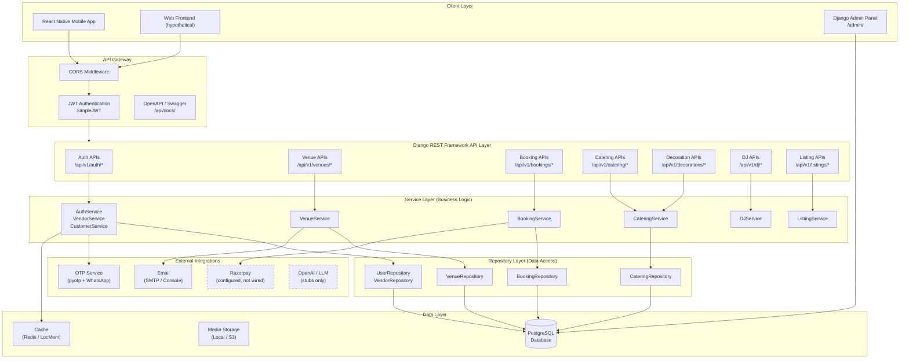
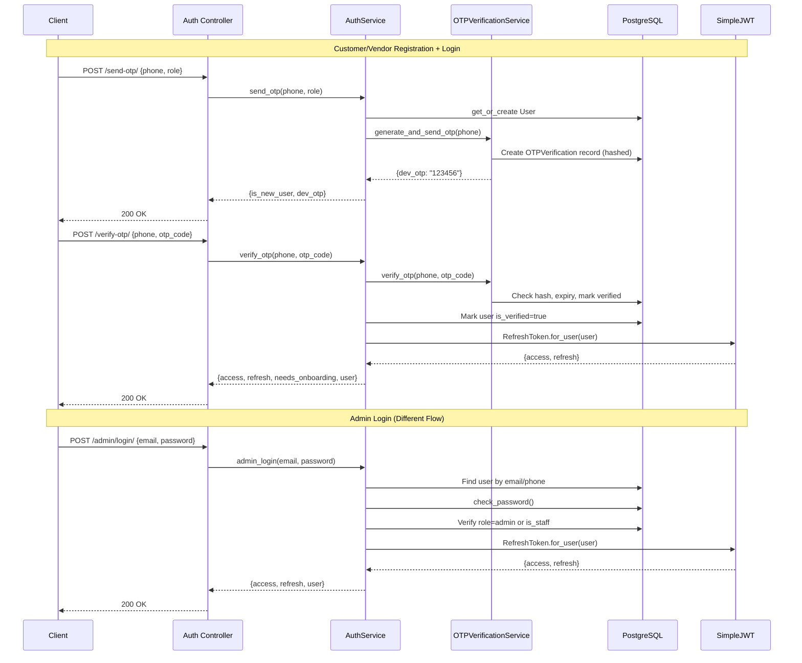
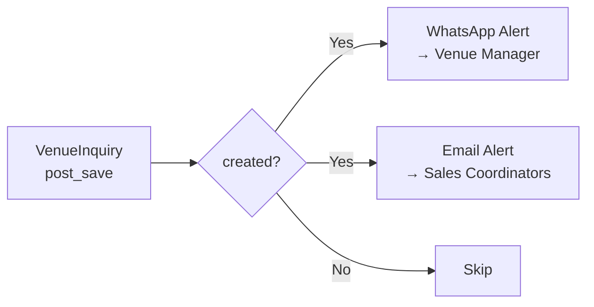

# PlanMyVivah — System Architecture

> Traced from actual codebase. All components reference real files and implementations.

---

## High-Level Architecture Diagram



> **Dashed borders** indicate configured but not fully implemented integrations.

---

## Layered Architecture (Detail)

Every Django app follows this consistent layered pattern:

```
┌─────────────────────────────────────────────────────────────┐
│                     URL Router (routes/)                     │
│         Maps URL patterns to Controller classes              │
├─────────────────────────────────────────────────────────────┤
│                   Controller (controllers/)                   │
│  APIView / ViewSet — validates input via Serializers         │
│  → Calls Service layer                                       │
│  → Returns standardized response (success/error/created)     │
│  → ZERO business logic, ZERO ORM queries                     │
├─────────────────────────────────────────────────────────────┤
│                     Serializer (serializers/)                 │
│  DRF Serializers — input validation, output formatting       │
│  Separate List/Detail/Write serializers per model            │
├─────────────────────────────────────────────────────────────┤
│                     Service (services/)                       │
│  Business logic, authorization checks, orchestration         │
│  → Calls Repository layer                                    │
│  → Raises AppException subclasses                            │
├─────────────────────────────────────────────────────────────┤
│                    Repository (repositories/)                 │
│  All ORM queries — read, write, filter, aggregate            │
│  → Returns QuerySets or Model instances                      │
│  → Never called from Controllers directly                    │
├─────────────────────────────────────────────────────────────┤
│                       Model (models/)                        │
│  Django ORM model definitions                                │
│  Field types, constraints, indexes, choices                  │
│  → Mapped to PostgreSQL tables via migrations                │
├─────────────────────────────────────────────────────────────┤
│                      PostgreSQL                              │
└─────────────────────────────────────────────────────────────┘
```

---

## Authentication Architecture



### JWT Configuration

| Setting | Value | Source |
|---|---|---|
| Access Token Lifetime | 1 day | `settings/base.py` |
| Refresh Token Lifetime | 30 days | `settings/base.py` |
| Algorithm | HS256 | Default |
| Token Rotation | Enabled | `ROTATE_REFRESH_TOKENS = True` |
| Token Blacklisting | Enabled | `BLACKLIST_AFTER_ROTATION = True` |
| Auth Header | `Bearer <token>` | Default |

---

## API Response Pattern

All API endpoints return a standardized response format (source: `apps/common/responses/`):

### Success Response
```json
{
  "success": true,
  "message": "Operation successful.",
  "data": { ... }
}
```

### Error Response
```json
{
  "success": false,
  "message": "Validation error",
  "errors": { ... }
}
```

### Helper Functions
| Function | HTTP Status | Usage |
|---|---|---|
| `success(data, message)` | 200 | Successful read/update |
| `created(data, message)` | 201 | Successful creation |
| `error(message, errors)` | 400/custom | Validation/business errors |
| `not_found(message)` | 404 | Resource not found |
| `forbidden(message)` | 403 | Access denied |

---

## Signal Architecture



**Source:** `apps/venues/signals.py`

| Signal | Trigger | Action | Status |
|---|---|---|---|
| `handle_venue_inquiry_created` | VenueInquiry post_save (created=True) | WhatsApp to venue manager + Email to coordinators | **IMPLEMENTED** |

---

## Middleware Stack

From `settings/base.py` (in order):

1. `SecurityMiddleware` — HTTPS, HSTS headers
2. `CorsMiddleware` — Cross-origin request handling
3. `SessionMiddleware` — Django sessions
4. `CommonMiddleware` — URL normalization
5. `CsrfViewMiddleware` — CSRF protection
6. `AuthenticationMiddleware` — Request user injection
7. `MessageMiddleware` — Flash messages

---

## Installed Apps

### Django Core
- `django.contrib.admin`
- `django.contrib.auth`
- `django.contrib.contenttypes`
- `django.contrib.sessions`
- `django.contrib.messages`
- `django.contrib.staticfiles`

### Third-Party
- `rest_framework` — API framework
- `rest_framework_simplejwt` — JWT authentication
- `rest_framework_simplejwt.token_blacklist` — Token revocation
- `corsheaders` — CORS handling
- `storages` — AWS S3 file storage
- `drf_spectacular` — OpenAPI schema generation
- `phonenumber_field` — Phone number validation

### Platform Apps
- `apps.accounts` — User, auth, vendor/customer profiles
- `apps.venues` — Venue management
- `apps.bookings` — Booking & availability
- `apps.catering` — Catering packages & menu
- `apps.decorations` — Decoration packages & tiers
- `apps.dj` — DJ packages & equipment
- `apps.listings` — Generic multi-category listings
- `apps.common` — Shared infrastructure
- `apps.ai_services` — AI/LLM stubs
- `apps.ai_agents` — AI agent stubs
- `apps.analytics` — Analytics (minimal)

---

## AI/Agent Architecture (Stubs)

The system has placeholder files for an AI-powered recommendation engine:

| File | Purpose | Status |
|---|---|---|
| `ai_services/llm_service.py` | OpenAI LLM wrapper | **STUB** — class defined, not integrated |
| `ai_services/embedding_service.py` | Text embeddings | **STUB** |
| `ai_services/prompt_builder.py` | Prompt templates | **STUB** |
| `ai_services/image_generation_service.py` | AI image generation | **STUB** |
| `ai_services/vector_search_service.py` | Similarity search | **STUB** |
| `ai_agents/base_agent.py` | Agent base class | **STUB** |
| `ai_agents/venue_agent.py` | Venue recommendation | **STUB** |
| `ai_agents/budget_agent.py` | Budget planning | **STUB** |
| `ai_agents/decor_agent.py` | Decoration suggestions | **STUB** |
| `ai_agents/availability_agent.py` | Availability checking | **STUB** |
| `ai_agents/wedding_planner_agent.py` | Full planning orchestrator | **STUB** |

> These modules are registered in `INSTALLED_APPS` but have no integration points with the API controllers.
