# CelebrationPlatform Entity-Relationship (ER) Diagram & Schema Specifications

Welcome to the definitive schema design guide for **CelebrationPlatform**! Below you will find a highly detailed Mermaid ER diagram and deep-dive specifications for each entity in the database.

---

## 📊 Interactive Entity-Relationship (ER) Diagram

```mermaid
erDiagram
    %% Accounts Module
    User ||--o| VendorProfile : "has profile"
    User ||--o| CustomerProfile : "has profile"
    User ||--o{ Booking : "makes booking"
    
    %% OTP Verification
    User ||..o{ OTP : "receives OTP (by phone)"

    %% Vendor Profile & Venues
    VendorProfile ||--o{ Venue : "owns"
    VendorProfile ||--o{ CateringPackage : "offers"
    VendorProfile ||--o{ DecorationPackage : "offers"
    VendorProfile ||--o{ DJPackage : "offers"

    %% Venues & Associated Services/Sub-Entities
    Venue ||--o{ VenueImage : "has images"
    Venue ||--o{ VenueInquiry : "receives inquiry"
    Venue ||--o{ VenueDeal : "promotes via"
    Venue ||--o{ VendorRoom : "accommodates in"
    Venue ||--o{ VenueAvailability : "tracks availability"
    Venue ||--o{ BlockedDate : "blocks calendar"
    
    %% Junctions/Links to Services
    Venue ||--o{ VenueCatering : "configures"
    Venue ||--o{ VenueDecoration : "configures"
    Venue ||--o{ VenueDJ : "configures"

    CateringPackage ||--o{ VenueCatering : "linked by"
    DecorationPackage ||--o{ VenueDecoration : "linked by"
    DJPackage ||--o{ VenueDJ : "linked by"

    %% Service Sub-Entities
    CateringPackage ||--o{ CateringMenuItem : "contains"
    DecorationPackage ||--o{ DecorationTier : "contains"
    DJPackage ||--o{ DJEquipment : "uses"

    %% Bookings Module & Service Bundling
    Venue ||--o{ Booking : "receives booking"
    CateringPackage ||--o{ Booking : "bundled in"
    DecorationPackage ||--o{ Booking : "bundled in"
    DJPackage ||--o{ Booking : "bundled in"

    %% Entity Attributes & Column Types
    User {
        bigint id PK
        varchar phone UK "E.164 Format"
        varchar email "Nullable"
        varchar full_name
        varchar role "customer | vendor | admin"
        varchar avatar "Image URL"
        boolean is_active
        boolean is_staff
        boolean is_verified
        timestamp created_at
        timestamp updated_at
        varchar password "Hashed"
    }

    CustomerProfile {
        bigint id PK
        bigint user_id FK "1:1 OneToOneField"
        date wedding_date
        varchar partner_name
        varchar city
        varchar state
        integer guest_count
        decimal budget_min
        decimal budget_max
        varchar planning_status "WeddingStatus choice"
        boolean needs_catering
        boolean needs_decoration
        boolean needs_dj
        boolean needs_planner
        timestamp created_at
        timestamp updated_at
    }

    VendorProfile {
        bigint id PK
        bigint user_id FK "1:1 OneToOneField"
        varchar vendor_type "venue | decorator | caterer | dj | planner | photographer | makeup | etc."
        varchar business_name
        text description
        varchar city
        varchar state
        text address
        varchar gstin
        varchar logo "Image URL"
        boolean is_approved
        timestamp created_at
        timestamp updated_at
    }

    OTP {
        bigint id PK
        varchar phone "OTP Target"
        varchar code "Hashed/Plain OTP"
        timestamp created_at
        boolean is_used
    }

    Venue {
        bigint id PK
        bigint vendor_id FK "ForeignKey"
        varchar name
        varchar venue_type "wedding_garden | resort | banquet_hall | etc."
        text description
        varchar city
        varchar state
        text address
        varchar pincode
        decimal latitude
        decimal longitude
        integer min_capacity
        integer max_capacity
        decimal price_per_day
        decimal min_price
        decimal avg_price
        decimal max_price
        boolean has_inhouse_decoration
        boolean has_inhouse_catering
        boolean has_inhouse_dj
        boolean has_inhouse_planner
        boolean has_parking
        boolean has_accommodation
        boolean is_ac
        boolean is_outdoor
        boolean is_active
        boolean is_verified
        decimal avg_rating
        integer total_bookings
        timestamp created_at
        timestamp updated_at
    }

    VenueImage {
        bigint id PK
        bigint venue_id FK
        varchar image "Image URL"
        boolean is_primary
        varchar caption
        timestamp created_at
    }

    VenueInquiry {
        bigint id PK
        bigint venue_id FK
        varchar name
        varchar phone
        varchar email
        varchar location
        decimal budget
        integer rooms_needed
        date event_date
        varchar event_type
        integer guest_count
        text message
        varchar status "pending | responded | closed"
        timestamp created_at
    }

    VenueDeal {
        bigint id PK
        bigint venue_id FK
        varchar title
        date start_date
        date end_date
        decimal discounted_price
        boolean is_active
        text notes
        timestamp created_at
        timestamp updated_at
    }

    VendorRoom {
        bigint id PK
        bigint venue_id FK
        varchar name
        integer capacity
        decimal price_per_night
        integer total_rooms
        text amenities
        boolean is_active
        timestamp created_at
        timestamp updated_at
    }

    VenueAvailability {
        bigint id PK
        bigint venue_id FK "UK (venue_id, date)"
        date date "UK (venue_id, date)"
        boolean is_available
        varchar note
    }

    BlockedDate {
        bigint id PK
        bigint venue_id FK
        date date_from
        date date_to
        varchar reason "booked | maintenance | holiday | other"
        varchar note
        timestamp created_at
    }

    CateringPackage {
        bigint id PK
        bigint vendor_id FK "Nullable (null = Platform default)"
        varchar name
        varchar cuisine_type "veg | nonveg | both | jain | etc."
        varchar tier "low | medium | average | high"
        decimal price_per_plate
        integer min_plates
        text description
        boolean is_active
        timestamp created_at
    }

    CateringMenuItem {
        bigint id PK
        bigint package_id FK
        varchar name
        varchar category "Starter | Main | Dessert | etc."
        boolean is_veg
        text description
    }

    VenueCatering {
        bigint id PK
        bigint venue_id FK "UK (venue_id, package_id)"
        bigint package_id FK "UK (venue_id, package_id)"
        varchar policy "inhouse | both"
        boolean is_default
        varchar note
    }

    DecorationPackage {
        bigint id PK
        bigint vendor_id FK "Nullable (null = Platform default)"
        varchar name
        varchar style "royal | floral | minimal | modern | etc."
        text description
        text includes "Comma-separated items"
        varchar image "Image URL"
        boolean is_active
        timestamp created_at
    }

    DecorationTier {
        bigint id PK
        bigint package_id FK
        varchar tier_name "Basic | Premium | Royal"
        decimal price
        text description
    }

    VenueDecoration {
        bigint id PK
        bigint venue_id FK "UK (venue_id, package_id)"
        bigint package_id FK "UK (venue_id, package_id)"
        varchar policy "inhouse | both"
        boolean is_default
        varchar note
    }

    DJPackage {
        bigint id PK
        bigint vendor_id FK "Nullable (null = Platform default)"
        varchar name
        varchar tier "low | medium | average | high"
        decimal price
        integer hours
        text description
        boolean is_active
        timestamp created_at
    }

    DJEquipment {
        bigint id PK
        bigint package_id FK
        varchar item_name
        integer quantity
    }

    VenueDJ {
        bigint id PK
        bigint venue_id FK "UK (venue_id, package_id)"
        bigint package_id FK "UK (venue_id, package_id)"
        varchar policy "inhouse | both"
        boolean is_default
        varchar note
    }

    Booking {
        bigint id PK
        bigint venue_id FK "PROTECT"
        bigint customer_id FK "PROTECT (User)"
        date event_date
        varchar session "morning | afternoon | evening | full_day"
        integer guest_count
        varchar event_type
        bigint catering_package_id FK "SET_NULL, Nullable"
        bigint decoration_package_id FK "SET_NULL, Nullable"
        bigint dj_package_id FK "SET_NULL, Nullable"
        decimal venue_amount
        decimal catering_amount
        decimal decoration_amount
        decimal dj_amount
        decimal total_amount
        decimal advance_paid
        decimal balance_due
        varchar status "pending | confirmed | cancelled | completed | refunded"
        text cancellation_reason
        text notes
        varchar payment_order_id
        varchar payment_payment_id
        timestamp created_at
        timestamp updated_at
    }
```

---

## 🔑 Key Architectural & Design Considerations

> [!IMPORTANT]
> **Django Migrations Disabled**
> The setting `MIGRATION_MODULES` is set to `None` in Django's settings (`base.py`). The schema and database structures are maintained directly or synchronized using the custom `sync_tables` django-admin command.

> [!NOTE]
> **Polymorphic / Platform Defaults Pattern**
> Service packages (`CateringPackage`, `DecorationPackage`, and `DJPackage`) allow a nullable `vendor_id`. A `null` value indicates a **platform-wide default package** managed by the system admin, which can be linked to any venue, while a non-null vendor refers to vendor-managed custom packages.

> [!TIP]
> **Dynamic Financial Calculations in Bookings**
> The `Booking` model dynamically calculates `balance_due` during the save cycle (`balance_due = total_amount - advance_paid`), with active safety validation constraints preventing a negative `balance_due` or an `advance_paid` higher than `total_amount`.

---

## 🏛️ Module Breakdown & Relations

### 1. accounts
* **`User` (users)**: The root authenticating entity. Utilizes `phone` as the `USERNAME_FIELD` (E.164 verification standard).
* **`CustomerProfile`**: Contains specific customer-oriented booking/planning state (like event budget ranges, wedding details, planning states, and filter selections).
* **`VendorProfile`**: Central gateway for service providers. Linked 1:1 with User, and acts as the parent of Venues, Catering, Decoration, and DJ packages.

### 2. venues
* **`Venue`**: The central asset. Offers accommodation flags, detailed capacity thresholds, geolocation pointers, and in-house capability indicators.
* **`VenueImage`**: Dynamic gallery tracking multiple assets with a primary display flag.
* **`VenueInquiry`**: Captured leads from users containing guest counts, message content, and contact info.
* **`VenueDeal`**: Auto-generated or manual promotions with date-range validity.
* **`VendorRoom`**: Accommodation details specifying suite names, capacity, nightly rates, and specific room counts.

### 3. bookings
* **`Booking`**: Full receipt and transactional status for a venue, containing optional bundled packages from catering, decorations, and DJ categories. It features protection mechanisms on delete (`models.PROTECT`) to preserve historical audit logs.
* **`VenueAvailability`**: Date-based calendar state mapping.
* **`BlockedDate`**: Broad calendars blocks set by vendors (e.g. holidays, maintenance blocks).

### 4. services (catering, decorations, dj)
* **Packages & Tiers/Items**: Each package maintains granular list structures (such as `CateringMenuItem`, `DecorationTier`, and `DJEquipment`) representing details shown to customers.
* **Venue Links**: Junction models (`VenueCatering`, `VenueDecoration`, `VenueDJ`) tie services directly to venues under custom policies (`inhouse` only vs. outside allowance).
